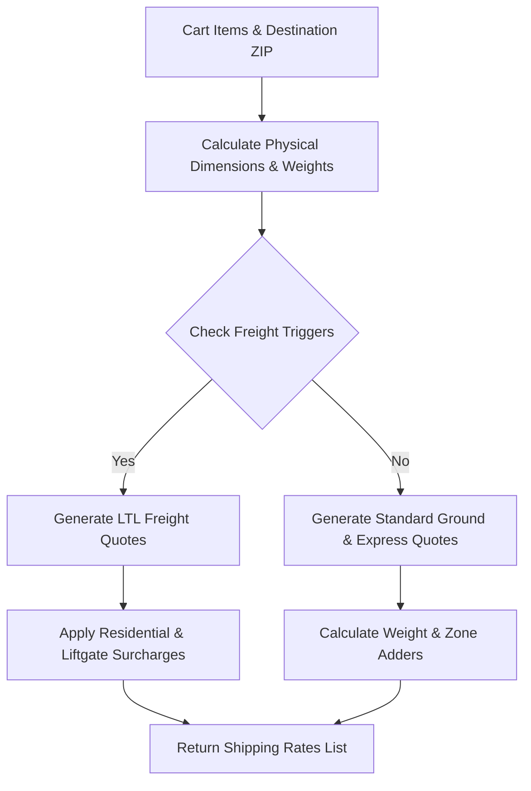

# Shipping & LTL Freight Calculator Integration Guide

This guide details the architecture, core code, and integration steps to port the **LTL Freight / Standard Ground Shipping Calculator** to another website.

---

## 1. System Architecture

The shipping engine uses a **Rules-Based Classification & Estimation** model. It dynamically determines whether an order can be shipped via Standard ground carriers (UPS/FedEx) or requires LTL (Less-Than-Truckload) Freight.



### Freight Triggers
An order is classified as **LTL Freight** if any of the following are met:
1. **Oversized Dimensions:** Any single item dimension (Length/Width) exceeds **96 inches**.
2. **Oversized Girth:** Total package girth (`Length + 2 * (Width + Height)`) exceeds **130 inches**.
3. **Weight Limits:** Total order weight exceeds **150 lbs**.
4. **Freight-Only Products:** Specific product types (e.g., Canopy Tents, heavy A-Frames with mounts).

---

## 2. Core Shipping Engine (TypeScript/JavaScript)

Save this file as `shippingCalculator.ts` or convert it to your platform's backend language:

```typescript
export interface ShippingRate {
  id: string;
  name: string;
  price: number;
  deliveryEstimate: string;
  description: string;
}

export interface PhysicalSpecs {
  weightLbs: number;
  isFreight: boolean;
  lengthInches: number;
  widthInches: number;
  heightInches: number;
}

/**
 * Parses size strings (e.g., "18\" x 24\"", "8' x 10'", "24x36") into inches and square footage.
 */
export function parseDimensions(sizeStr: string): { width: number; height: number; areaSqFt: number } {
  if (!sizeStr) return { width: 12, height: 12, areaSqFt: 1 };

  try {
    const clean = sizeStr.replace(/\\/g, "").replace(/"/g, "").replace(/”/g, "").replace(/’/g, "'").trim();
    const parts = clean.split(/x|\*|by/i).map(p => p.trim());
    if (parts.length >= 2) {
      const w = parseFloat(parts[0]);
      const h = parseFloat(parts[1]);

      const isWFeet = parts[0].includes("'") || parts[0].toLowerCase().includes("ft");
      const isHFeet = parts[1].includes("'") || parts[1].toLowerCase().includes("ft");

      const wIn = isWFeet ? w * 12 : w;
      const hIn = isHFeet ? h * 12 : h;

      if (isNaN(wIn) || isNaN(hIn)) {
        return { width: 12, height: 12, areaSqFt: 1 };
      }

      return {
        width: wIn,
        height: hIn,
        areaSqFt: (wIn * hIn) / 144
      };
    }
  } catch (e) {
    console.warn("Failed to parse size string:", sizeStr, e);
  }

  return { width: 12, height: 12, areaSqFt: 1 };
}

/**
 * Resolves weight, freight status, and packaged dimensions for an item based on its name and configuration.
 */
export function getItemPhysicalSpecs(
  productTitle: string,
  sizeStr: string,
  customOptions: Record<string, string> = {}
): PhysicalSpecs {
  const title = productTitle.toLowerCase();
  const { width, height, areaSqFt } = parseDimensions(sizeStr);

  let weightLbs = 1.0;
  let isFreight = false;
  let lengthInches = Math.max(width, height);
  let widthInches = Math.min(width, height);
  let heightInches = 1.0; // Thickness/Depth

  // Weight mapping by product category
  if (title.includes("banner")) {
    if (title.includes("retractable") || title.includes("roll up") || title.includes("roll-up")) {
      weightLbs = 12.0;
      lengthInches = 36.0;
      widthInches = 6.0;
      heightInches = 6.0;
    } else {
      const multiplier = title.includes("fabric") ? 0.07 : 0.11;
      weightLbs = Math.max(1.0, areaSqFt * multiplier);
      lengthInches = Math.max(12, lengthInches);
      widthInches = Math.max(6, widthInches / 4); // Rolled up banner dimensions
      heightInches = 4.0;
    }
  } else if (title.includes("tent") || title.includes("canopy")) {
    weightLbs = 48.0;
    lengthInches = 62.0;
    widthInches = 10.0;
    heightInches = 10.0;
    isFreight = true;
  } else if (title.includes("a-frame")) {
    weightLbs = 22.0;
    lengthInches = 42.0;
    widthInches = 26.0;
    heightInches = 5.0;
  } else if (title.includes("yard sign")) {
    const quantity = parseInt(customOptions["Quantity"] || "1") || 1;
    let unitWeight = 0.3;
    const hardware = (customOptions["Stands / Stakes"] || customOptions["Stakes"] || "").toLowerCase();
    
    if (hardware.includes("wood yard arm") || hardware.includes("l-shaped")) {
      unitWeight += 5.5;
    } else if (hardware.includes("h-stake") || hardware.includes("wire")) {
      unitWeight += 0.8;
    }
    weightLbs = unitWeight;
    lengthInches = Math.max(18, lengthInches);
    widthInches = Math.max(24, widthInches);
    heightInches = 0.5;
  } else if (title.includes("real estate panel")) {
    let unitWeight = 1.8;
    const frame = (customOptions["Frame / Post"] || customOptions["Frame"] || "").toLowerCase();
    if (frame.includes("metal frame") || frame.includes("banjo")) {
      unitWeight += 14.0;
    } else if (frame.includes("post") || frame.includes("colonial")) {
      unitWeight += 8.5;
    }
    weightLbs = unitWeight;
  } else if (title.includes("aluminum")) {
    weightLbs = Math.max(1.0, areaSqFt * 0.75);
  } else if (title.includes("acrylic")) {
    weightLbs = Math.max(1.5, areaSqFt * 1.25);
  } else if (title.includes("coroplast")) {
    weightLbs = Math.max(0.5, areaSqFt * 0.25);
  } else if (title.includes("foam board")) {
    weightLbs = Math.max(0.5, areaSqFt * 0.15);
  } else if (title.includes("business card")) {
    const qty = parseInt(customOptions["Quantity"] || "500") || 500;
    weightLbs = (qty / 1000) * 4.0;
    lengthInches = 8.0;
    widthInches = 4.0;
    heightInches = 3.0;
  } else if (title.includes("postcard") || title.includes("flyer") || title.includes("brochure") || title.includes("door hanger")) {
    const qty = parseInt(customOptions["Quantity"] || "100") || 100;
    weightLbs = (qty / 100) * 1.2;
    lengthInches = 11.0;
    widthInches = 8.5;
    heightInches = 2.0;
  } else if (title.includes("apparel") || title.includes("shirt")) {
    weightLbs = 0.5;
  } else if (title.includes("mug")) {
    weightLbs = 1.3;
    lengthInches = 5.0;
    widthInches = 5.0;
    heightInches = 5.0;
  }

  // Dimension & Girth freight checks
  const girth = lengthInches + 2 * (widthInches + heightInches);
  if (weightLbs > 150 || lengthInches > 96 || girth > 130) {
    isFreight = true;
  }

  return {
    weightLbs,
    isFreight,
    lengthInches,
    widthInches,
    heightInches,
  };
}

/**
 * Calculates local, ground, and LTL rates based on items, zip code, and LTL surcharges.
 */
export function calculateShippingRates(
  items: { productTitle: string; size: string; quantity: number; customOptions?: Record<string, string> }[],
  zipCode: string,
  options: { residential?: boolean; liftgate?: boolean } = {}
): ShippingRate[] {
  let totalWeight = 0;
  let hasFreightItem = false;
  let maxSingleDimension = 0;

  for (const item of items) {
    const specs = getItemPhysicalSpecs(item.productTitle, item.size, item.customOptions || {});
    const itemTotalWeight = specs.weightLbs * item.quantity;
    totalWeight += itemTotalWeight;

    if (specs.isFreight) {
      hasFreightItem = true;
    }

    const itemMaxDim = Math.max(specs.lengthInches, specs.widthInches);
    if (itemMaxDim > maxSingleDimension) {
      maxSingleDimension = itemMaxDim;
    }
  }

  if (totalWeight > 150 || maxSingleDimension > 96) {
    hasFreightItem = true;
  }

  // Always supply a Local Pickup option (Free)
  const rates: ShippingRate[] = [
    {
      id: "local_pickup",
      name: "Free Local Pickup",
      price: 0.0,
      deliveryEstimate: "Next Business Day",
      description: "Pick up at our main storefront headquarters.",
    },
  ];

  const zip = zipCode.trim();
  // Regional settings (Example: Florida zones)
  const isLocalZone = zip.startsWith("330") || zip.startsWith("331") || zip.startsWith("332") || zip.startsWith("333") || zip.startsWith("334");
  const isStateZone = zip.startsWith("32") || zip.startsWith("33") || zip.startsWith("34");

  let zoneMultiplier = 1.0;
  if (!isStateZone) {
    zoneMultiplier = 1.4; // Out of state
  } else if (!isLocalZone) {
    zoneMultiplier = 1.15; // In-state long distance
  }

  if (hasFreightItem) {
    // ── LTL Freight Pricing Rules ──
    let baseFreight = 120.0;
    if (!isLocalZone) baseFreight = 180.0;
    if (!isStateZone) baseFreight = 290.0;

    const weightAdder = totalWeight * 1.1 * zoneMultiplier;
    let freightCost = baseFreight + weightAdder;

    // Apply accessory fees
    if (options.residential !== false) {
      freightCost += 55.0; // Residential delivery fee
    }
    if (options.liftgate) {
      freightCost += 45.0; // Liftgate unloading fee
    }

    rates.push({
      id: "ltl_freight",
      name: "LTL Freight Shipping",
      price: Math.round(freightCost * 100) / 100,
      deliveryEstimate: isLocalZone ? "2-3 Business Days" : "4-7 Business Days",
      description: `Freight LTL delivery for heavy/oversized items. ${
        options.liftgate ? "Includes liftgate service." : "Dock or manual unloading required."
      }`,
    });
  } else {
    // ── Standard Courier Shipping Rules ──
    let baseStandard = 9.95;
    let baseExpedited = 24.95;

    if (!isLocalZone) {
      baseStandard = 14.95;
      baseExpedited = 39.95;
    }
    if (!isStateZone) {
      baseStandard = 19.95;
      baseExpedited = 59.95;
    }

    const standardCost = Math.round((baseStandard + totalWeight * 0.75 * zoneMultiplier) * 100) / 100;
    const expeditedCost = Math.round((baseExpedited + totalWeight * 1.5 * zoneMultiplier) * 100) / 100;

    rates.push({
      id: "standard_ground",
      name: "Standard Courier (Ground)",
      price: standardCost,
      deliveryEstimate: isLocalZone ? "Next Business Day" : isStateZone ? "2 Business Days" : "3-5 Business Days",
      description: "Delivered directly to your door via standard ground courier.",
    });

    rates.push({
      id: "expedited_courier",
      name: "Expedited Courier (Express)",
      price: expeditedCost,
      deliveryEstimate: isLocalZone ? "Next Day Morning" : "1-2 Business Days",
      description: "Prioritized air/express shipment.",
    });
  }

  return rates;
}
```

---

## 3. Server Endpoint Example (Next.js App Router)

Create an endpoint (e.g., `/api/shipping-rates/route.ts`) to calculate pricing on the backend:

```typescript
import { NextResponse } from "next/server";
import { calculateShippingRates } from "@/lib/shippingCalculator";

export async function POST(req: Request) {
  try {
    const body = await req.json();
    const { items, zipCode, residential, liftgate } = body;

    if (!items || !zipCode) {
      return NextResponse.json({ error: "Missing required parameters" }, { status: 400 });
    }

    const rates = calculateShippingRates(items, zipCode, {
      residential: residential ?? true,
      liftgate: liftgate ?? false
    });

    return NextResponse.json({ rates });
  } catch (error: any) {
    return NextResponse.json({ error: error.message || "Failed to calculate rates" }, { status: 500 });
  }
}
```

---

## 4. Frontend Form Interface Example (React)

Add Residential and Liftgate checkboxes to your checkout form if freight is triggered:

```tsx
import React, { useState, useEffect } from "react";

export function ShippingMethodSelector({ cartItems, zipCode }) {
  const [rates, setRates] = useState([]);
  const [loading, setLoading] = useState(false);
  const [residential, setResidential] = useState(true);
  const [liftgate, setLiftgate] = useState(false);
  const [selectedRateId, setSelectedRateId] = useState("");

  // Check if any cart item is heavy/oversized
  const isFreightEligible = cartItems.some(item => {
    const girth = item.length + 2 * (item.width + item.height);
    return item.weight > 150 || item.length > 96 || girth > 130 || item.category === "tints";
  });

  useEffect(() => {
    if (!zipCode || zipCode.length < 5) return;

    const fetchRates = async () => {
      setLoading(true);
      try {
        const response = await fetch("/api/shipping-rates", {
          method: "POST",
          headers: { "Content-Type": "application/json" },
          body: JSON.stringify({
            items: cartItems,
            zipCode,
            residential,
            liftgate
          })
        });
        const data = await response.json();
        setRates(data.rates || []);
        if (data.rates?.length > 0) {
          setSelectedRateId(data.rates[0].id);
        }
      } catch (err) {
        console.error("Failed to load rates", err);
      } finally {
        setLoading(false);
      }
    };

    fetchRates();
  }, [cartItems, zipCode, residential, liftgate]);

  return (
    <div className="space-y-4">
      {isFreightEligible && (
        <div className="p-4 bg-orange-50 border border-orange-200 rounded-xl space-y-2">
          <h4 className="font-bold text-orange-800 text-sm">Oversized/Heavy Items Detected</h4>
          <p className="text-xs text-orange-700">LTL Freight charges apply. Select accessorial options below:</p>
          
          <div className="flex flex-col space-y-2 pt-2">
            <label className="flex items-center gap-2 text-xs font-semibold text-slate-700">
              <input
                type="checkbox"
                checked={residential}
                onChange={(e) => setResidential(e.target.checked)}
              />
              Deliver to a Residential Address (+$55.00)
            </label>
            <label className="flex items-center gap-2 text-xs font-semibold text-slate-700">
              <input
                type="checkbox"
                checked={liftgate}
                onChange={(e) => setLiftgate(e.target.checked)}
              />
              Require Liftgate Unloading Service (+$45.00)
            </label>
          </div>
        </div>
      )}

      <div className="space-y-2">
        <h3 className="font-bold text-sm">Select Shipping Option</h3>
        {loading ? (
          <p className="text-xs text-gray-500">Calculating rates...</p>
        ) : (
          rates.map(rate => (
            <label key={rate.id} className="flex justify-between items-center p-3 border rounded-xl cursor-pointer hover:bg-slate-50">
              <div className="flex items-start gap-2">
                <input
                  type="radio"
                  name="shippingRate"
                  checked={selectedRateId === rate.id}
                  onChange={() => setSelectedRateId(rate.id)}
                  className="mt-1"
                />
                <div>
                  <span className="font-bold text-xs">{rate.name}</span>
                  <span className="block text-[10px] text-gray-400">{rate.deliveryEstimate} - {rate.description}</span>
                </div>
              </div>
              <span className="font-bold text-sm">${rate.price.toFixed(2)}</span>
            </label>
          ))
        )}
      </div>
    </div>
  );
}
```

---

## 5. Prompt to Generate This in Any Other Language

Copy the prompt below to generate an identical calculator in **PHP, Python, Ruby, Shopify Liquid, Go, or C#**:

```markdown
I want to implement a custom e-commerce shipping calculator that dynamically switches between Standard Ground (UPS/FedEx) and Heavy/Oversized LTL Freight shipping based on cart items, quantities, dimensions, weights, and destination ZIP codes.

Please implement a class/module with the following specifications:

1. Physical Specs Resolution:
   - Calculate item weight based on material type or size. For instance, banners calculate weight as (Area SqFt * 0.11 lbs), while Canopy Tents are 48 lbs, and A-Frame stands are 22 lbs.
   - Extract dimensions (length, width, depth) for each product.
   - Mark an item as "Freight" if its weight > 150 lbs, any dimension > 96", or girth (Length + 2*(Width + Height)) > 130".

2. Shipping Rate Calculation:
   - If the total order contains ANY freight items, or if the total weight of the combined order exceeds 150 lbs, or if the maximum single dimension exceeds 96", apply LTL Freight rules.
   - Otherwise, apply Standard Ground / Expedited Courier rules.

3. Pricing Surcharges (LTL Freight):
   - Local Florida (ZIPs starting with 330-334) Base: $120.00.
   - Long-distance Florida (ZIPs starting with 32, 33, 34) Base: $180.00.
   - Out-of-state Base: $290.00.
   - Weight adder: Weight * 1.1 * Distance Multiplier.
   - Residential Surcharge: Add $55.00 if the destination is a house/apartment.
   - Liftgate Surcharge: Add $45.00 if the carrier needs to lower the pallet to the ground.

4. Pricing (Standard Courier):
   - Local Florida Base: $9.95 (Ground) / $24.95 (Express).
   - Long-distance Florida Base: $14.95 (Ground) / $39.95 (Express).
   - Out-of-state Base: $19.95 (Ground) / $59.95 (Express).
   - Weight adder: Weight * $0.75 (Ground) / Weight * $1.50 (Express).

Provide the code implementation and describe how to integrate this in [YOUR TARGET LANGUAGE/FRAMEWORK HERE, e.g., Laravel/PHP, WooCommerce, Python Django].
```
